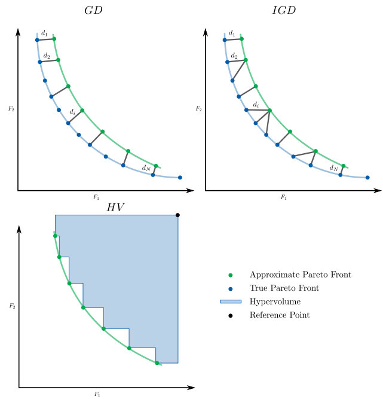
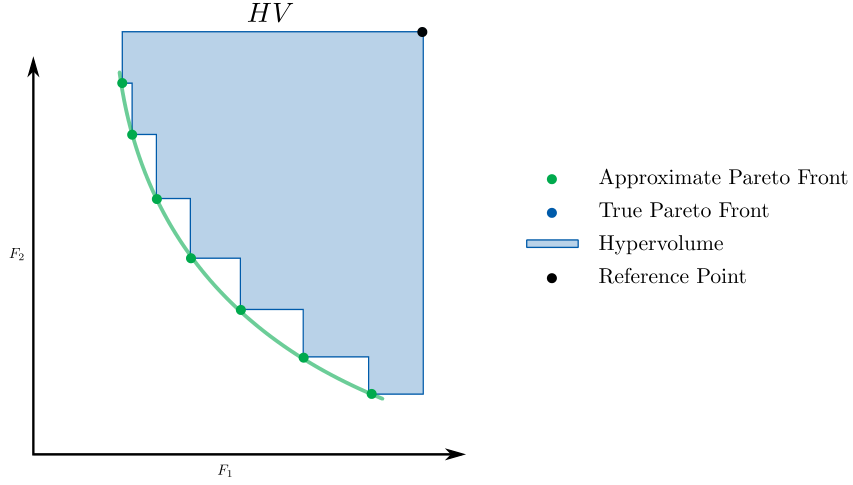

# Performance Indicators


Metaheuristics.jl includes performance indicators to assess evolutionary optimization
algorithms performance.

Available indicators:

```@contents
Pages = [ "indicators.md"]
Depth = 3
```




!!! warning "Minimization is always assumed here."
    Note that in `Metaheuristics.jl`, **minimization** is always assumed.
    Therefore these indicators have been developed for minimization problems.

```@docs
 Metaheuristics.PerformanceIndicators
```

## Generational Distance


```@docs
 Metaheuristics.PerformanceIndicators.gd
```


## Generational Distance Plus

```@docs
 Metaheuristics.PerformanceIndicators.gd_plus
```


## Inverted Generational Distance


```@docs
 Metaheuristics.PerformanceIndicators.igd
```


## Inverted Generational Distance Plus

```@docs
 Metaheuristics.PerformanceIndicators.igd_plus
```

## Spacing Indicator

```@docs
 Metaheuristics.PerformanceIndicators.spacing
```

## Covering Indicator (C-metric)

```@docs
 Metaheuristics.PerformanceIndicators.covering
```


## Hypervolume



```@docs
 Metaheuristics.PerformanceIndicators.hypervolume
```

### Examples

Computing hypervolume indicator from vectors in a `Matrix`

```@repl
import Metaheuristics.PerformanceIndicators: hypervolume

f1 = collect(0:10); # objective 1
f2 = 10 .- collect(0:10); # objective 2

front = [ f1 f2 ] 

reference_point = [11, 11]

hv = hypervolume(front, reference_point)
```

Now, let's compute the hypervolume implementation in Julia from result of  `NSGA3`
when solving DTLZ2 test problem.


```@repl
using Metaheuristics
import Metaheuristics.PerformanceIndicators: hypervolume
import Metaheuristics: TestProblems, get_non_dominated_solutions

f, bounds, true_front = TestProblems.DTLZ2();

result = optimize(f, bounds, NSGA3());

approx_front = get_non_dominated_solutions(result.population)

reference_point = nadir(result.population)

hv = hypervolume(approx_front, reference_point)
```


