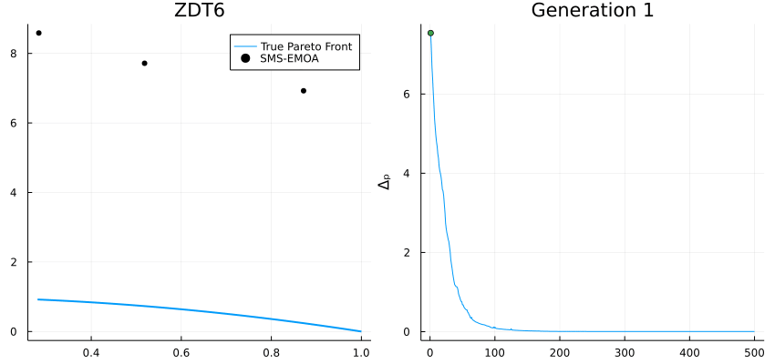
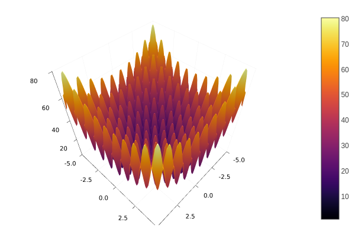
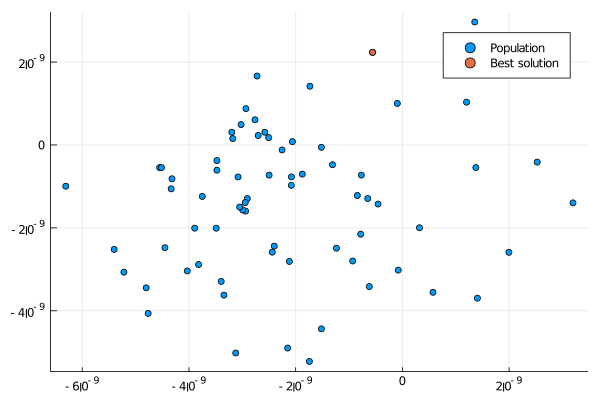
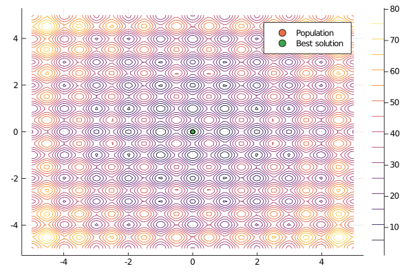
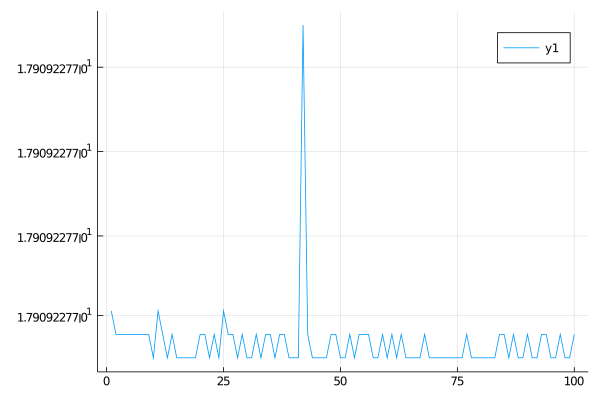
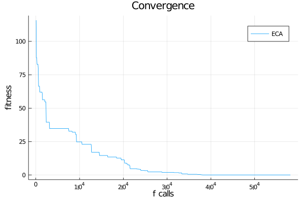
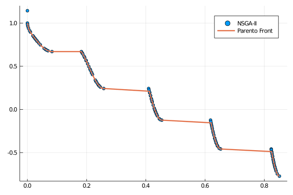

# Visualization




Presenting the results using fancy plots is an important part of solving optimization problems.
In this part, we use the [Plots.jl](http://docs.juliaplots.org/latest/) package which can be installed via de Pkg prompt within
Julia:

Type `]` and then:

```
pkg> add Plots
```

Or:

```
julia> import Pkg; Pkg.add("Plots")
```

Once Plots is installed on your Julia distribution, you will be able to reproduce the 
following examples.


Assume you want to solve the following minimization problem.



Minimize:

$f(x) = 10D + \sum_{i=1}^{D}  x_i^2 - 10\cos(2\pi x_i)$

where $x\in[-5, 5]^{D}$, i.e., $-5 \leq x_i \leq 5$ for $i=1,\ldots,D$. $D$ is the
dimension number, assume $D=10$.


## Population Distribution

Let's solve the above optimization problem and plot the resulting population (projecting
two specific dimensions).

```julia
using Metaheuristics
using Plots
gr()


# objective function
f(x) = 10length(x) + sum( x.^2 - 10cos.(2π*x)  )

# number of variables (dimension)
D = 10

# bounds
bounds = [-5ones(D) 5ones(D)]'

# Common options
options = Options(seed=1)

# Optimizing
result = optimize(f, bounds, ECA(options=options))

# positions in matrix NxD 
X = positions(result)

scatter(X[:,1], X[:,2], label="Population")

x = minimizer(result)
scatter!(x[1:1], x[2:2], label="Best solution")


# (optional) save figure
savefig("final-population.png")

```



If your optimization problem is scalable, then you also can plot level curves.
In this case, let's assume that $D=2$.


```julia
using Metaheuristics
using Plots
gr()


# objective function
f(x) = 10length(x) + sum( x.^2 - 10cos.(2π*x)  )

# number of variables (dimension)
D = 2

# bounds
bounds = [-5ones(D) 5ones(D)]'

# Common options
options = Options(seed=1)

# Optimizing
result = optimize(f, bounds, ECA(options=options))

# positions in matrix NxD 
X = positions(result)

xy = range(-5, 5, length=100)
contour(xy, xy, (a,b) -> f([a, b]))

scatter!(X[:,1], X[:,2], label="Population")

x = minimizer(result)
scatter!(x[1:1], x[2:2], label="Best solution")


# (optional) save figure
savefig("final-population-contour.png")
```




### Objective Function Values

Metaheuristics.jl implements some methods to obtain the objective function values (fitness)
from the solutions in the resulting population. One of the most useful methods is [`fvals`](@ref).
In this case, let's use [`PSO`](@ref).

```julia
using Metaheuristics
using Plots
gr()


# objective function
f(x) = 10length(x) + sum( x.^2 - 10cos.(2π*x)  )

# number of variables (dimension)
D = 10

# bounds
bounds = [-5ones(D) 5ones(D)]'

# Common options
options = Options(seed=1)

# Optimizing
result = optimize(f, bounds, PSO(options=options))

f_values = fvals(result)
plot(f_values)

# (optional) save figure
savefig("fvals.png")
```




## Convergence

Sometimes, it is useful to plot the convergence plot at the end of the optimization process.
To do that, it is necessary to set `store_convergence = true` in [`Options`](@ref).
Metaheuristics implements a method called [`convergence`](@ref).

```julia
using Metaheuristics
using Plots
gr()


# objective function
f(x) = 10length(x) + sum( x.^2 - 10cos.(2π*x)  )

# number of variables (dimension)
D = 10

# bounds
bounds = [-5ones(D) 5ones(D)]'

# Common options
options = Options(seed=1, store_convergence = true)

# Optimizing
result = optimize(f, bounds, ECA(options=options))

f_calls, best_f_value = convergence(result)

plot(xlabel="f calls", ylabel="fitness", title="Convergence")
plot!(f_calls, best_f_value, label="ECA")

# (optional) save figure
savefig("convergence.png")
```



## Animate convergence

Also, you can plot the population and convergence in the same figure.


### Single-Objective Problem

```julia
using Metaheuristics
using Plots
gr()


# objective function
f(x) = 10length(x) + sum( x.^2 - 10cos.(2π*x)  )

# number of variables (dimension)
D = 10

# bounds
bounds = [-5ones(D) 5ones(D)]'

# Common options
options = Options(seed=1, store_convergence = true)

# Optimizing
result = optimize(f, bounds, ECA(options=options))

f_calls, best_f_value = convergence(result)

animation = @animate for i in 1:length(result.convergence)
    l = @layout [a b]
    p = plot( layout=l)

    X = positions(result.convergence[i])
    scatter!(p[1], X[:,1], X[:,2], label="", xlim=(-5, 5), ylim=(-5,5), title="Population")
    x = minimizer(result.convergence[i])
    scatter!(p[1], x[1:1], x[2:2], label="")

    # convergence
    plot!(p[2], xlabel="Generation", ylabel="fitness", title="Gen: $i")
    plot!(p[2], 1:length(best_f_value), best_f_value, label=false)
    plot!(p[2], 1:i, best_f_value[1:i], lw=3, label=false)
    x = minimizer(result.convergence[i])
    scatter!(p[2], [i], [minimum(result.convergence[i])], label=false)
end

# save in different formats
# gif(animation, "anim-convergence.gif", fps=30)
mp4(animation, "anim-convergence.mp4", fps=30)

```


### Multi-Objective Problem


```julia
import Metaheuristics: optimize, SMS_EMOA, TestProblems, pareto_front, Options
import Metaheuristics.PerformanceIndicators: Δₚ
using Plots; gr()

# get test function
f, bounds, pf = TestProblems.ZDT6();

# optimize using SMS-EMOA
result = optimize(f, bounds, SMS_EMOA(N=70,options=Options(iterations=500,seed=0, store_convergence=true)))

# true pareto front
B = pareto_front(pf)
# error to the true front
err = [ Δₚ(r.population, pf) for r in result.convergence]
# generate plots
a = @animate for i in 1:5:length(result.convergence)
    A = pareto_front(result.convergence[i])

    p = plot(B[:, 1], B[:,2], label="True Pareto Front", lw=2,layout=(1,2), size=(850, 400))
    scatter!(p[1], A[:, 1], A[:,2], label="SMS-EMOA", markersize=4, color=:black, title="ZDT6")
    plot!(p[2], eachindex(err), err, ylabel="Δₚ", legend=false)
    plot!(p[2], 1:i, err[1:i], title="Generation $i")
    scatter!(p[2], [i], err[i:i])
end

# save animation
gif(a, "ZDT6.gif", fps=20)
```


## Pareto Front


```julia
import Metaheuristics: optimize, NSGA2, TestProblems, pareto_front, Options
using Plots; gr()

f, bounds, solutions = TestProblems.ZDT3();

result = optimize(f, bounds, NSGA2(options=Options(seed=0)))

A = pareto_front(result)
B = pareto_front(solutions)

scatter(A[:, 1], A[:,2], label="NSGA-II")
plot!(B[:, 1], B[:,2], label="Parento Front", lw=2)
savefig("pareto.png")
```





## Live Plotting

The [`optimize`](@ref) function has a keyword parameter named `logger` that contains
a function pointer. Such function will receive the [`State`](@ref) at the end of each
iteration in the main optimization loop.

```julia
import Metaheuristics: optimize, NSGA2, TestProblems, pareto_front, Options, fvals
using Plots; gr()

f, bounds, solutions = TestProblems.ZDT3();
pf = pareto_front(solutions)

logger(st) = begin
    A = fvals(st)
    scatter(A[:, 1], A[:,2], label="NSGA-II", title="Gen: $(st.iteration)")
    plot!(pf[:, 1], pf[:,2], label="Parento Front", lw=2)
    gui()
    sleep(0.1)
end

result = optimize(f, bounds, NSGA2(options=Options(seed=0)), logger=logger)

```

## Visualizing Constraint Violations

For constrained optimization, visualize how constraint violations decrease over time:

```julia
using Metaheuristics
using Plots
gr()

# Constrained problem
function constrained_f(x)
    fx = sum(x)
    gx = [sum(x.^2) + 1.0, x[1]^2 - 2]  # two inequality constraints
    hx = [0.0]
    return fx, gx, hx
end

bounds = boxconstraints(lb = -5ones(5), ub = 5ones(5))
options = Options(store_convergence=true, seed=1)

result = optimize(constrained_f, bounds, ECA(options=options))

# Extract constraint violations over time
violations = Float64[]
for state in result.convergence
    # Get best solution's constraint violation
    best = state.best_sol
    total_violation = sum(max.(0, best.g)) + sum(abs.(best.h))
    push!(violations, total_violation)
end

# Plot
plot(1:length(violations), violations, 
     xlabel="Generation", 
     ylabel="Total Constraint Violation",
     title="Constraint Satisfaction Progress",
     xscale=:log10,
     legend=false)
savefig("constraint_progress.png")
```

## Comparing Multiple Algorithms

Visualize convergence of multiple algorithms on the same problem:

```julia
using Metaheuristics
using Plots
gr()

# Define test problem
f(x) = sum(x.^2 .- 10cos.(2π*x)) .+ 10length(x)
bounds = boxconstraints(lb = -5ones(10), ub = 5ones(10))

# Test multiple algorithms
algorithms = [
    ("ECA", ECA),
    ("DE", DE),
    ("PSO", PSO)
]

# Run and collect convergence
p = plot(xlabel="Function Evaluations", ylabel="Best Fitness", 
         title="Algorithm Comparison", yscale=:log10)

for (name, algo) in algorithms
    options = Options(store_convergence=true, seed=1)
    algo_with_opts = algo(;options=options)
    
    result = optimize(f, bounds, algo_with_opts)
    f_calls, best_f = convergence(result)
    
    plot!(p, f_calls, best_f, label=name, lw=2)
end

savefig(p, "algorithm_comparison.png")
```

## 3D Pareto Front Visualization

For three-objective problems:

```julia
using Metaheuristics
using Plots
gr()

# Three-objective problem (DTLZ2)
f, bounds, pf = Metaheuristics.TestProblems.DTLZ2(3)  # 3 objectives

result = optimize(f, bounds, NSGA3(options=Options(seed=0)))

# Get Pareto front
A = pareto_front(result)

# 3D scatter plot
scatter(A[:,1], A[:,2], A[:,3],
        xlabel="f₁", ylabel="f₂", zlabel="f₃",
        title="3D Pareto Front - DTLZ2",
        label="Approximation",
        markersize=3,
        camera=(135, 45))

savefig("pareto_3d.png")
```

## Constraint Violation Heatmap

Visualize constraint violations across 2D decision space:

```julia
using Metaheuristics
using Plots
gr()

# 2D constrained problem
function f_2d(x)
    fx = sum(x.^2)
    gx = [x[1]^2 + x[2]^2 - 1]  # circle constraint
    hx = [0.0]
    return fx, gx, hx
end

# Create grid for visualization
x1_range = range(-2, 2, length=100)
x2_range = range(-2, 2, length=100)

# Calculate constraint violations
violation_map = zeros(length(x2_range), length(x1_range))
for (i, x2) in enumerate(x2_range)
    for (j, x1) in enumerate(x1_range)
        _, g, _ = f_2d([x1, x2])
        violation_map[i, j] = max(0, g[1])  # only positive violations
    end
end

# Plot
heatmap(x1_range, x2_range, violation_map,
        xlabel="x₁", ylabel="x₂",
        title="Constraint Violation Map",
        color=:viridis)

# Optimize and overlay solution
result = optimize(f_2d, boxconstraints(lb=[-2,-2], ub=[2,2]), ECA())
x_sol = minimizer(result)
scatter!([x_sol[1]], [x_sol[2]], 
         label="Solution", 
         color=:red, 
         markersize=10,
         markershape=:star)

savefig("constraint_heatmap.png")
```

## Interactive Plotting with Makie

For interactive visualizations, consider using [Makie.jl](https://makie.juliaplots.org/):

```julia
# Note: Install GLMakie first
# using Pkg; Pkg.add("GLMakie")

using GLMakie
using Metaheuristics

# Optimize
f, bounds, true_pf = Metaheuristics.TestProblems.ZDT1()
result = optimize(f, bounds, NSGA2())

# Get fronts
approx_pf = pareto_front(result)
true_front = pareto_front(true_pf)

# Create interactive plot
fig = Figure(resolution=(800, 600))
ax = Axis(fig[1, 1], xlabel="f₁", ylabel="f₂", title="Interactive Pareto Front")

# Plot
scatter!(ax, true_front[:, 1], true_front[:, 2], 
         label="True Front", color=:blue, markersize=5)
scatter!(ax, approx_pf[:, 1], approx_pf[:, 2], 
         label="Approximation", color=:red, markersize=8)

axislegend(ax, position=:rt)
display(fig)
```

Interactive plots allow you to:
- Zoom and pan
- Hover for values  
- Rotate 3D plots
- Export high-quality figures

## Decision Space Animation

Animate how population explores decision space:

```julia
using Metaheuristics
using Plots
gr()

# 2D optimization problem
f(x) = (x[1] - 1)^2 + (x[2] + 1)^2
bounds = boxconstraints(lb = [-3.0, -3], ub = [3.0, 3])
options = Options(store_convergence=true, iterations=50, seed=1)

result = optimize(f, bounds, PSO(options=options))

# Create contour background
x_grid = range(-3, 3, length=50)
y_grid = range(-3, 3, length=50)
z_grid = [f([x, y]) for y in y_grid, x in x_grid]

# Animate
anim = @animate for (i, state) in enumerate(result.convergence)
    contour(x_grid, y_grid, z_grid, levels=20, 
            xlabel="x₁", ylabel="x₂", 
            title="Generation $i",
            colorbar=true)
    
    # Plot population
    X = positions(state)
    scatter!(X[:, 1], X[:, 2], 
             label="Population", 
             color=:red, 
             markersize=4)
    
    # Plot best
    x_best = minimizer(state)
    scatter!([x_best[1]], [x_best[2]], 
             label="Best", 
             color=:yellow, 
             markersize=10,
             markershape=:star)
end

gif(anim, "decision_space_animation.gif", fps=10)
```

